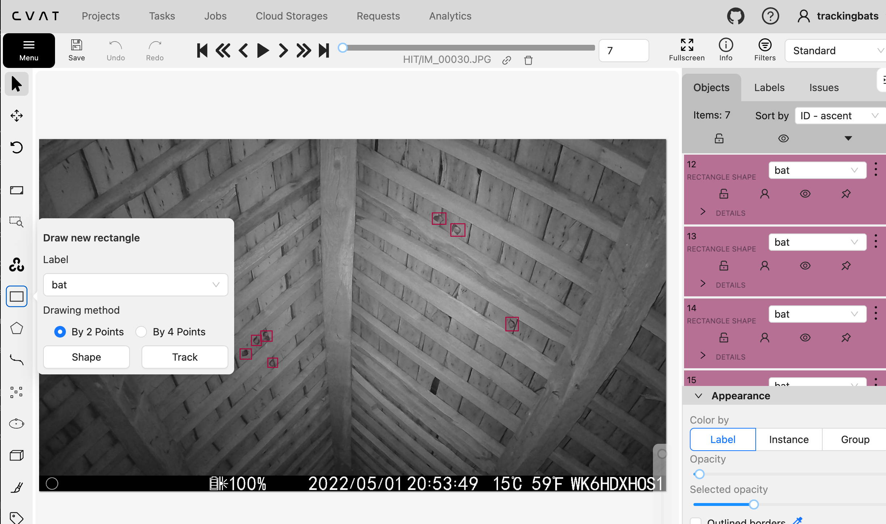

# BatDetector: Modular Open Source Pipeline for Bat Monitoring

## Overview

This project provides a robust and scalable bat detection pipeline tailored for wildlife imagery. Leveraging dual background subtraction, morphological post-processing, and an ensemble of lightweight CNN and Vision Transformer (ViT) classifiers, it efficiently identifies and localizes bats in complex scenes.

This pipeline was designed and implemented by **Onciul Alexandra** and **Klinovsky Sebastian**.

## Features

* Dual background subtraction using configurable algorithms (e.g., PBAS, MOG2)
* Morphological operations for noise removal and contour extraction
* ROI (Region of interest) cropping and enhancement via gamma correction / histogram equalization
* Fast rejection of background using a tiny CNN (MobileNetV3)
* Accurate classification using an ensemble of EfficientNet-B0 and ViT
* COCO format export for detected bats and summary CSV reporting
* Optional temporal clustering for improved batch processing
* Fully configurable via CLI

---

## Project Structure

```
bat_classifier/
│
├── models/
│   ├── inference.py
│   └── models.py
│
├── pipeline/
│   ├── core.py
│   ├── mask_processing.py
│   ├── subtractors.py
│   └── models_classification/  # Weights folder
│
├── utils/
│   ├── bounding_boxes.py
│   ├── clustering.py
│   ├── coco_utils.py
│   ├── image_utils.py
│   └── time_utils.py
│
├── config.py
├── main.py
└── README.md
```

---

## Setup and Usage

### Prerequisite: Python ≥ 3.10

Make sure Python 3.10 or higher is installed. You can check with:

```bash
python3 --version
```

If Python is not installed or the version is too low, follow these steps:

* On Ubuntu/Debian:

```bash
sudo apt update
sudo apt install python3.11 python3.11-venv python3.11-dev
```

* On Windows or macOS: download and install from [https://www.python.org/downloads/](https://www.python.org/downloads/)

### 1. **Create and activate a virtual environment**

In your terminal, make sure you’re in the project root directory, then run:

```bash
python3 -m venv .venv
source .venv/bin/activate
```

### 2. **Install all requirements**

```bash
pip install -r requirements.txt
```

### 3. **Troubleshooting (if `pip install -r requirements.txt` fails)**

If you encounter errors while installing dependencies, first upgrade your packaging tools and install any missing core libraries:

```bash
pip install --upgrade pip setuptools wheel
pip install numpy
pip install pybgs
.
.
.
```

Then retry:

```bash
pip install -r requirements.txt
```

### 4. **Run an example inference**

Once all dependencies are installed, you can run the bat classifier on a sample folder of images. For example:

```bash
python3 bat_classifier/main.py \
    --path_img_bats Cam1/ \
    --output_dir outputs/Cam1 \
    --visualization
```

* `--path_img_bats Cam1/` points to the directory containing your bat images (e.g., `Cam1/`).
* `--output_dir outputs/Cam1` specifies where to save the results.
* `--visualization` enables per-image visual outputs (e.g., bounding boxes or heatmaps).

## Output
After the command finishes, you’ll find the results inside the `outputs/`


* `output_dir/crops/` — Cropped images around detected bats
* `output_dir/mask/` — Binary masks from the dual subtraction
* `output_dir/*.coco.json` — COCO-format annotation file
* `output_dir/predictions.csv` — Detailed predictions with confidences
* `output_dir/summary.csv` — Per-image summary of bat presence

You can use the generated **COCO JSON** annotations along with tools **CVAT** to manually refine bounding boxes or retrain models on reannotated data. This is useful for boosting accuracy on edge cases or tailoring the model to specific bat species.

---

## Configuration Options

You can also fine-tune the detection behavior through the `config.py` file:

* Adjust the **confidence threshold** for classifying detections (`HIGH_CONF_THRESHOLD`, default: `0.85`).
* Modify the **weighting between ViT and EfficientNet** in the ensemble:

  * `ENSEMBLE_VIT_WEIGHT` (default: `0.85`)
  * `ENSEMBLE_CNN_WEIGHT` (default: `0.15`)

| Argument                            | Description                                            |
| ----------------------------------- | ------------------------------------------------------ |
| `--path_img_bats`                   | Directory with input images                            |
| `--output_dir`                      | Root folder for outputs                                |
| `--model_path`                      | Path to small CNN (MobileNetV3) weights                |
| `--efficientnet`                    | Path to EfficientNet-B0 weights                        |
| `--vit_model`                       | Path to ViT model weights                              |
| `--bg_path`                         | Directory of background frames (for warm-up)           |
| `--roi_rect`                        | ROI cropping rectangle (x,y,w,h)                       |
| `--gamma_value`                     | Gamma correction (default: 1.0)                        |
| `--combine_method`                  | Mask fusion strategy: `average`, `and`, or `or`        |
| `--bgs_primary` / `--bgs_secondary` | Background subtractor names                            |
| `--num_splits`                      | Clusters for temporal segmentation (0 = no clustering) |
| `--visualization`                   | Show intermediate outputs with OpenCV GUI              |

---

## Best Camera Setup Tips


**1. Fix the Camera Firmly**
Mount the camera securely. Even small movements reduce accuracy. Keep the view fixed for all images and maintain a single, consistent background.

**2. Keep Lighting Steady**
Avoid bright sunlight or flickering lights from windows. Sudden changes confuse background subtraction. If lighting varies a lot, use `--num_splits` to split images by time (e.g. 24 = split into 24 time-based groups). Avoid low light when possible—while the model can handle darkness, good lighting improves results.

**3. Good Camera Angle**
If possible tilt the camera slightly upward. Make sure bats are fully visible in the frame and if possible too, avoid cropping bats at the edges. This helps the model detect them better.

**4. Simple Background**
Use flat, clean walls or ceilings. Avoid busy textures, vegetation, or moving objects like branches or curtains, this helps the background subtractor work better.

---

## Tips for Using the Pipeline

**1. Add Background Images**
Use the `--bg_path` option with empty-scene images (no bats). It helps the subtractor detect motion more reliably, we advise you to choose the first background images based on the time and advise you to choose at least 5 to 100 images.

**2. Try Gamma Correction**
For low-contrast images, try `--gamma_value 1.2` or `1.5` to improve visibility before classification.

**3. Use `--visualization`**
See bounding boxes visually to debug and find the best parameters for your scene.

**4. Tune the Threshold and Weights**
In `config.py`, adjust `HIGH_CONF_THRESHOLD` to filter predictions: increase to reduce false positives, decrease to catch more bats. Use `--visualization` to test first, then re-run with final settings. You can also change model weights: ViT (more accurate, slower), EfficientNet (faster, less precise). Tune them for your use case.

**5. Use Both Models or Just One**
The ensemble (EfficientNet + ViT) is robust. But you can use just one by setting its weight to 1.0 and the other to 0.0 in `config.py`.

**6. Check Results in CVAT**
Open `.coco.json` in CVAT to inspect and fix bounding boxes. This improves annotations and can be used grounth truth dataset for event better future results.

**7. Group Similar Images**
Only process images with the same camera, background, and conditions together. If light varies, split images by time using `--num_splits`. This helps the model learn consistent patterns and improves accuracy.

**8. Use ROI Rectangle for Cropping**
Use the `--roi_rect` option to crop the relevant area of each image. This is especially useful when the camera captures extra space outside the main region of interest. Metadata or visual inspection can help define the best crop area (format: `x,y,w,h`).

**9. Read the Logs**
Check `summary.csv` and `predictions.csv` for confidence levels and errors. Use them to understand model behavior and refine inputs.

## Annotating Images with CVAT

We use [CVAT](https://github.com/openvinotoolkit/cvat) (Computer Vision Annotation Tool) to inspect and refine the model’s detections. Below are the steps to install CVAT, set up a “bat” label, and upload/download annotations in COCO format.

---

### 1. Install and Launch CVAT

Follow the official CVAT installation guide:

- **Documentation:**  
  https://docs.cvat.ai/docs/administration/basics/installation/

Once CVAT is up and running (e.g., via Docker Compose), log in to the web interface (typically at `http://localhost:8080/`).

---

### 2. Create a New Project and Define the “bat” Label

1. In the CVAT dashboard, click **“Create Project”** and give it a name.
2. In the **Label Constructor** field, paste the following JSON to define a single label called `"bat"` with an attribute to distinguish single vs. multiple instances:

   ```json
   [
     {
       "name": "bat",
       "id": 2,
       "color": "#800040",
       "type": "any",
       "attributes": [
         {
           "id": 1,
           "name": "SingleOrMultiple",
           "input_type": "select",
           "mutable": true,
           "values": [
             "single",
             "multiple"
           ],
           "default_value": "single"
         }
       ]
     }
   ]
___
### 3.Add your pictures 
You can Now add your picture on which the model has run. 
___

### 4.Add your pictures 
You can now add your picture on which the model has run and you you see you created task in the Tasks in the top navigation bar.
___

### 5.Upload annotations 
Click on action and select upload annotations.
Afterwards select the "COCO 1.0" format and put the generated output COCO file.
___
### 6.Annotation modification
Go on to Tasks and open your task. Click on Job# and now you can begin looking at the pictures. You will see now the detected bats, and you can refine and add annotations if needed. To modify one annotation simply drag and pull the given rectangle around the bat. 
In order to add an annotation, click on the rectangle on the left and select shape you can now create new annotations as well.
<p align="center">
  
</p>

___
### 7.Annotation export
In order to export the annotations, CVAT permits multiple exporting formats. Go to Tasks click on Actions and select export task dataset. Choose the format that suits you best for further analysis.
___
## Acknowledgements

This system was developed in collaboration with the **Natagora Microclimate Project**, a five-year initiative studying bat roost conditions in buildings across Wallonia, Belgium.

Due to the decline of traditional roosts from renovations and insulation, Natagora aims to identify environmental factors like temperature, humidity, and materials that support bat presence.

Our contribution focuses on the **automated detection of bats in camera footage**, reducing manual effort and helping quickly identify relevant images for conservation analysis.

---

## License

```
SPDX-License-Identifier: Apache-2.0
© 2025 Onciul Alexandra and Klinovsky Sebastian
```
